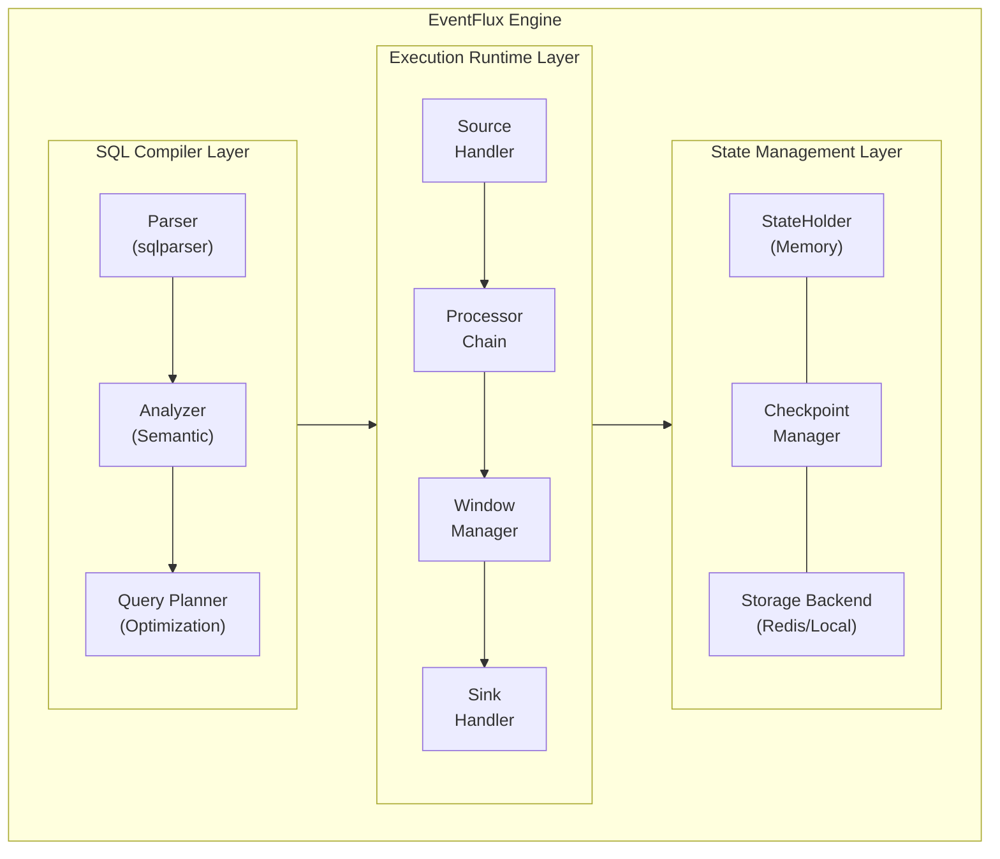

# Architecture Overview

EventFlux is designed as a modular, high-performance streaming engine with clear separation of concerns between parsing, planning, and execution.

## System Architecture



## Core Components

### 1. SQL Compiler

The SQL compiler transforms EventFlux queries into an optimized execution plan.

**Parser (`sql_compiler`)**
- Built on a vendored fork of `datafusion-sqlparser-rs`
- Extended with `EventFluxDialect` for streaming constructs
- Native support for WINDOW, MATCH, WITHIN clauses

**Semantic Analyzer**
- Type checking and validation
- Stream/table schema resolution
- Expression type inference

**Query Planner**
- Logical plan generation
- Query optimization
- Physical plan creation

### 2. Query API

The Query API defines the Abstract Syntax Tree (AST) structures:

```rust
// Core query structures
pub struct Query {
    pub input: InputSource,
    pub selector: Selector,
    pub output: OutputTarget,
    pub window: Option<WindowSpec>,
    pub pattern: Option<PatternSpec>,
}

// Stream definition
pub struct StreamDefinition {
    pub name: String,
    pub attributes: Vec<Attribute>,
}

// Window specification
pub enum WindowSpec {
    Tumbling(Duration),
    Sliding(Duration, Duration),
    Session(Duration),
    Length(usize),
    // ... 9 window types
}
```

### 3. Execution Runtime

The execution runtime processes events through a pipeline of processors:

```rust
pub trait Processor: Send + Sync {
    /// Process an incoming event
    fn process(&mut self, event: StreamEvent) -> Vec<StreamEvent>;

    /// Process timer-based triggers
    fn process_timer(&mut self, timestamp: i64) -> Vec<StreamEvent>;

    /// Get current processor state
    fn get_state(&self) -> ProcessorState;
}
```

**Processor Types:**
| Processor | Purpose |
|-----------|---------|
| `FilterProcessor` | WHERE clause filtering |
| `ProjectProcessor` | SELECT expression evaluation |
| `WindowProcessor` | Window aggregation (9 types) |
| `JoinProcessor` | Stream/table joins |
| `PatternProcessor` | Complex event detection |
| `GroupByProcessor` | GROUP BY aggregation |

## High-Performance Pipeline

EventFlux achieves high throughput through several optimizations:

### Lock-Free Data Structures

```rust
use crossbeam::queue::ArrayQueue;

pub struct EventPipeline {
    /// Lock-free bounded queue for event passing
    queue: ArrayQueue<StreamEvent>,
    /// Pipeline capacity
    capacity: usize,
}

impl EventPipeline {
    pub fn push(&self, event: StreamEvent) -> Result<(), PushError> {
        self.queue.push(event).map_err(|_| PushError::Full)
    }

    pub fn pop(&self) -> Option<StreamEvent> {
        self.queue.pop()
    }
}
```

### Object Pooling

Pre-allocated event objects minimize allocation overhead:

```rust
pub struct EventPool {
    pool: ArrayQueue<StreamEvent>,
    capacity: usize,
}

impl EventPool {
    pub fn acquire(&self) -> StreamEvent {
        self.pool.pop().unwrap_or_else(|| StreamEvent::new())
    }

    pub fn release(&self, event: StreamEvent) {
        // Return to pool if not full
        let _ = self.pool.push(event);
    }
}
```

### Backpressure Handling

Configurable strategies for handling backpressure:

| Strategy | Behavior | Use Case |
|----------|----------|----------|
| `Block` | Block producer until space available | Guaranteed delivery |
| `Drop` | Drop oldest events when full | Latest data priority |
| `DropNewest` | Reject new events when full | Historical data priority |
| `Unbounded` | Grow queue without limit | Testing only |

## Window Processing

Windows are central to stream processing. EventFlux implements 9 window types:

```rust
pub enum WindowType {
    /// Fixed, non-overlapping time windows
    Tumbling(Duration),
    /// Overlapping time windows
    Sliding { size: Duration, slide: Duration },
    /// Gap-based session windows
    Session(Duration),
    /// Count-based sliding window
    Length(usize),
    /// Count-based batch window
    LengthBatch(usize),
    /// Continuous time window
    Time(Duration),
    /// Time-based batch window
    TimeBatch(Duration),
    /// Event-time based window
    ExternalTime { timestamp_attr: String, duration: Duration },
    /// Delayed emission window
    Delay(Duration),
}
```

## Pattern Matching Engine

The pattern matching engine detects complex event sequences:

```rust
pub struct PatternMatcher {
    /// Pattern definition
    pattern: Pattern,
    /// Active partial matches
    active_matches: Vec<PartialMatch>,
    /// Time constraint
    within: Duration,
}

impl PatternMatcher {
    pub fn process(&mut self, event: StreamEvent) -> Vec<PatternMatch> {
        // 1. Try to extend existing partial matches
        // 2. Start new partial matches if event matches first element
        // 3. Clean up expired partial matches
        // 4. Return completed matches
    }
}
```

## Memory Model

EventFlux uses Rust's ownership model to ensure memory safety without garbage collection:

- **Zero-copy**: Events are passed by reference where possible
- **Arc sharing**: Shared state uses `Arc<T>` for safe concurrent access
- **Explicit lifetimes**: Compile-time memory safety guarantees
- **No GC pauses**: Predictable latency without garbage collection

## Performance Characteristics

| Metric | Target | Status |
|--------|--------|--------|
| Throughput | \>1M events/sec | Target |
| Latency (p99) | \<1ms | Target |
| Memory overhead | Efficient | Tested |
| GC pauses | None | Guaranteed |

## Next Steps

- [Event Pipeline](/docs/architecture/event-pipeline) - Deep dive into event processing
- [State Management](/docs/architecture/state-management) - Checkpointing and recovery
- [SQL Reference](/docs/sql-reference/queries) - Learn the query language
