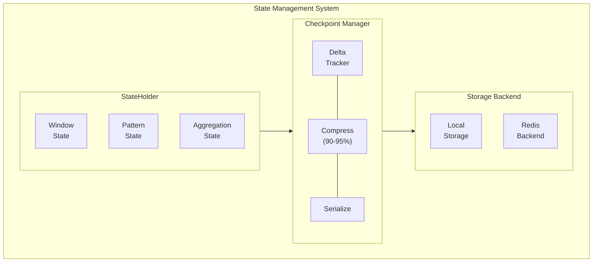

# State Management

EventFlux provides enterprise-grade state management with incremental checkpointing, compression, and point-in-time recovery capabilities.

## State Architecture



## StateHolder

The `StateHolder` is the primary interface for processor state:

```rust
pub struct StateHolder {
    /// Unique state identifier
    id: StateId,
    /// Current state data
    data: StateData,
    /// Change tracking for incremental checkpoints
    dirty_tracker: DirtyTracker,
    /// Last checkpoint sequence number
    checkpoint_seq: u64,
}

impl StateHolder {
    /// Get state value
    pub fn get<T: DeserializeOwned>(&self, key: &str) -> Option<T> {
        self.data.get(key).and_then(|v| bincode::deserialize(v).ok())
    }

    /// Set state value (marks as dirty)
    pub fn set<T: Serialize>(&mut self, key: &str, value: T) {
        let bytes = bincode::serialize(&value).unwrap();
        self.data.insert(key.to_string(), bytes);
        self.dirty_tracker.mark_dirty(key);
    }

    /// Remove state value
    pub fn remove(&mut self, key: &str) {
        self.data.remove(key);
        self.dirty_tracker.mark_deleted(key);
    }
}
```

## Checkpointing

### Incremental Checkpoints

Only changed state is persisted, minimizing I/O:

```rust
pub struct CheckpointManager {
    /// Storage backend
    storage: Box<dyn StorageBackend>,
    /// Checkpoint interval
    interval: Duration,
    /// Compression enabled
    compression: bool,
}

impl CheckpointManager {
    /// Create incremental checkpoint
    pub fn checkpoint(&self, state: &StateHolder) -> Result<CheckpointId, Error> {
        // 1. Get only dirty entries
        let delta = state.get_dirty_entries();

        // 2. Serialize delta
        let serialized = bincode::serialize(&delta)?;

        // 3. Compress (90-95% compression typical)
        let compressed = if self.compression {
            lz4::compress(&serialized)?
        } else {
            serialized
        };

        // 4. Write to storage
        let id = self.storage.write(compressed)?;

        // 5. Clear dirty flags
        state.clear_dirty();

        Ok(id)
    }
}
```

### Checkpoint Configuration

```rust
pub struct CheckpointConfig {
    /// How often to checkpoint
    pub interval: Duration,
    /// Enable compression
    pub compression: bool,
    /// Maximum checkpoints to retain
    pub max_retained: usize,
    /// Storage backend configuration
    pub storage: StorageConfig,
}

// Example configuration
let config = CheckpointConfig {
    interval: Duration::from_secs(60),
    compression: true,
    max_retained: 10,
    storage: StorageConfig::Local {
        path: PathBuf::from("/var/eventflux/checkpoints"),
    },
};
```

## Recovery

### Point-in-Time Recovery

Restore state from any checkpoint:

```rust
impl CheckpointManager {
    /// Restore from specific checkpoint
    pub fn restore(&self, checkpoint_id: CheckpointId) -> Result<StateHolder, Error> {
        // 1. Read checkpoint data
        let compressed = self.storage.read(checkpoint_id)?;

        // 2. Decompress if needed
        let serialized = if self.compression {
            lz4::decompress(&compressed)?
        } else {
            compressed
        };

        // 3. Deserialize state
        let state: StateData = bincode::deserialize(&serialized)?;

        // 4. Create StateHolder
        Ok(StateHolder::from_data(state))
    }

    /// Restore from latest checkpoint
    pub fn restore_latest(&self) -> Result<StateHolder, Error> {
        let latest = self.storage.get_latest_checkpoint()?;
        self.restore(latest)
    }
}
```

### Recovery Example

```rust
// Create runtime with recovery
let manager = EventFluxManager::new();

let runtime = manager
    .create_runtime(app_definition)?
    .with_checkpoint_config(CheckpointConfig {
        interval: Duration::from_secs(30),
        compression: true,
        ..Default::default()
    });

// Check for existing checkpoint
if let Some(checkpoint) = runtime.get_latest_checkpoint()? {
    println!("Restoring from checkpoint: {:?}", checkpoint.id);
    runtime.restore_from_checkpoint(checkpoint.id)?;
}

runtime.start();
```

## Storage Backends

### Local Storage

```rust
pub struct LocalStorageBackend {
    base_path: PathBuf,
}

impl StorageBackend for LocalStorageBackend {
    fn write(&self, data: Vec<u8>) -> Result<CheckpointId, Error> {
        let id = CheckpointId::new();
        let path = self.base_path.join(id.to_string());
        std::fs::write(path, data)?;
        Ok(id)
    }

    fn read(&self, id: CheckpointId) -> Result<Vec<u8>, Error> {
        let path = self.base_path.join(id.to_string());
        Ok(std::fs::read(path)?)
    }
}
```

### Redis Backend

```rust
pub struct RedisStorageBackend {
    client: redis::Client,
    prefix: String,
}

impl StorageBackend for RedisStorageBackend {
    fn write(&self, data: Vec<u8>) -> Result<CheckpointId, Error> {
        let id = CheckpointId::new();
        let key = format!("{}:{}", self.prefix, id);

        let mut conn = self.client.get_connection()?;
        conn.set_ex(key, data, 86400)?; // 24-hour TTL

        Ok(id)
    }

    fn read(&self, id: CheckpointId) -> Result<Vec<u8>, Error> {
        let key = format!("{}:{}", self.prefix, id);
        let mut conn = self.client.get_connection()?;
        Ok(conn.get(key)?)
    }
}
```

## State Types

### Window State

Windows maintain event buffers:

```rust
pub struct WindowState {
    /// Events in current window
    pub events: VecDeque<StreamEvent>,
    /// Window start time
    pub window_start: i64,
    /// Aggregation accumulators
    pub accumulators: HashMap<String, Accumulator>,
}
```

### Pattern State

Patterns track partial matches:

```rust
pub struct PatternState {
    /// Active partial matches
    pub partial_matches: Vec<PartialMatch>,
    /// Pattern definition
    pub pattern: Pattern,
    /// Time constraint
    pub within: Duration,
}
```

### Aggregation State

Aggregations maintain running totals:

```rust
pub struct AggregationState {
    /// Grouped accumulators
    pub groups: HashMap<GroupKey, GroupAccumulators>,
}

pub struct GroupAccumulators {
    pub count: u64,
    pub sum: f64,
    pub min: Option<f64>,
    pub max: Option<f64>,
    pub sum_squares: f64, // For stddev
}
```

## Compression

### Compression Ratio

EventFlux achieves 90-95% compression on typical state data:

| State Type | Uncompressed | Compressed | Ratio |
|------------|--------------|------------|-------|
| Window buffer | 10 MB | 0.8 MB | 92% |
| Pattern state | 5 MB | 0.4 MB | 92% |
| Aggregations | 2 MB | 0.15 MB | 93% |

### Compression Algorithm

Using LZ4 for fast compression/decompression:

```rust
pub fn compress(data: &[u8]) -> Result<Vec<u8>, Error> {
    let mut encoder = lz4::EncoderBuilder::new()
        .level(4) // Balance speed/ratio
        .build(Vec::new())?;
    encoder.write_all(data)?;
    Ok(encoder.finish().0)
}

pub fn decompress(data: &[u8]) -> Result<Vec<u8>, Error> {
    let mut decoder = lz4::Decoder::new(data)?;
    let mut output = Vec::new();
    decoder.read_to_end(&mut output)?;
    Ok(output)
}
```

## Best Practices

:::tip State Management

1. **Checkpoint frequently** - Minimize data loss on failure
2. **Use compression** - Reduces storage and I/O significantly
3. **Monitor state size** - Large state affects checkpoint time
4. **Clean up old checkpoints** - Prevent storage growth

:::

:::caution Considerations

- **State size** - Large windows/patterns increase checkpoint size
- **Checkpoint latency** - May briefly pause processing
- **Storage reliability** - Use reliable backends for production
- **Recovery time** - Larger state = longer recovery

:::

## Next Steps

- [Event Pipeline](/docs/architecture/event-pipeline) - Processing architecture
- [Architecture Overview](/docs/architecture/overview) - System design
- [Rust API](/docs/rust-api/configuration) - Runtime configuration
